 

 

### 📅 My year in commits — isometric view

 

### 🐍 Contribution snake

<picture>
  <source media="(prefers-color-scheme: dark)" srcset="https://raw.githubusercontent.com/Adityasiig/Adityasiig/output/github-contribution-grid-snake-dark.svg" />
  <source media="(prefers-color-scheme: light)" srcset="https://raw.githubusercontent.com/Adityasiig/Adityasiig/output/github-contribution-grid-snake.svg" />
  
</picture>

 

### 💻 Languages & habits

 

### 📊 Live stats

  

 

### 🎯 LeetCode

 

### 🏆 Achievements

 

### ⚡ What I'm building

> **[Health Tracker](https://github.com/Adityasiig/health-tracker)** — macro & fitness tracker, Indian food DB, AI coach, native Android · [live](https://health-tracker-five-xi.vercel.app/)
>
> **[TaskFlow](https://github.com/Adityasiig/TODO-list)** — priority-based to-do, drag & drop, offline · [live](https://adityasiig.github.io/TODO-list/)
>
> **[CDR Direct](https://github.com/Adityasiig/cdr-direct)** — telecom billing analysis · FastAPI + DuckDB · 357M rows, sub-second queries
>
> **[WebVulnScanner](https://github.com/Adityasiig/WebVulnScanner)** — modular web vuln scanner — SQLi · XSS · LFI · WAF evasion

 

auto-refreshed daily by github actions · <code>lowlighter/metrics</code> + <code>Platane/snk</code>

